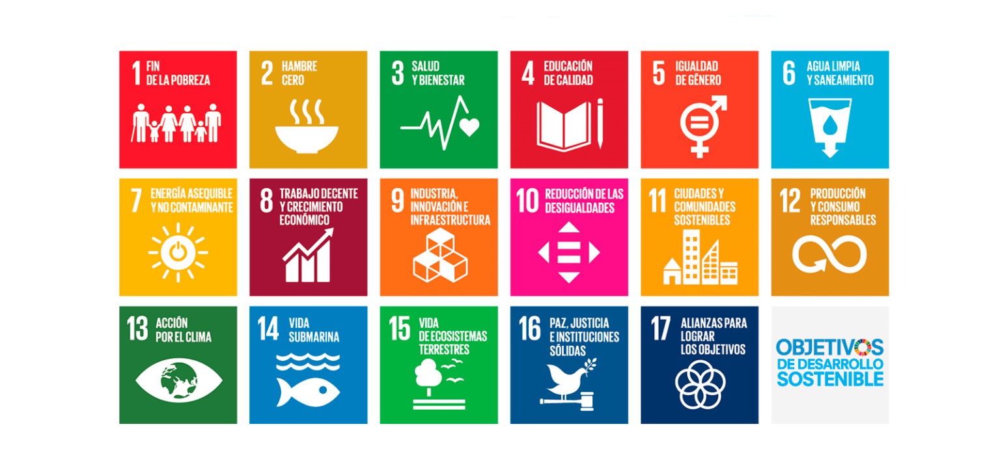

# 1. Els ODS rellevants per al sector TIC

En aquest apartat anem a conéixer quins Objectius de Desenvolupament Sostenible (ODS) són més rellevants per al sector TIC i com el desenvolupament de tecnologies pot contribuir a la consecució d’aquests objectius. Analitzar les oportunitats i els reptes que presenta la integració dels ODS en el sector TIC.

## 1.1 **Què són els ODS i per què són importants?**

Recordem que els **Objectius de Desenvolupament Sostenible (ODS)** són una sèrie de 17 objectius globals establerts per les Nacions Unides amb l'objectiu de **construir un món més just, sostenible i inclusiu**. Aquests objectius es van adoptar en 2015 com a part de l'Agenda 2030 per al Desenvolupament Sostenible.

Els ODS no només aborden temes com la **pobresa, la desigualtat, l’educació i la salut**, sinó que també tenen en compte **l'impacte ambiental, social i econòmic** de les activitats humanes.

El sector TIC juga un paper fonamental en la consecució d'aquests objectius, ja que les tecnologies poden ser utilitzades tant per millorar els processos i la productivitat com per **minimitzar l'impacte ambiental** i **millorar la qualitat de vida de les persones**.

## 1.2 **ODS clau per al sector TIC**

Tot i que tots els ODS tenen una rellevància transversal per al sector TIC, n'hi ha alguns que són especialment rellevants per les seves implicacions directes en l'activitat i el desenvolupament de noves tecnologies.

???info "ODS 4: **Educació de qualitat**"

    El sector TIC pot ajudar a millorar l'accés a l'educació i les oportunitats d'aprenentatge a través de plataformes en línia, recursos educatius digitals i solucions de **formació a distància**. Els dispositius digitals i el **programari educatiu** poden proporcionar accés a continguts educatius en zones remotes o subdesenvolupades.

    * **Exemple: Plataformes d'educació en línia** (ex. Coursera, Khan Academy) utilitzen tecnologies digitals per **millorar l’accessibilitat a l’educació** i **reducir les barreres geogràfiques**.

???info "ODS 7: **Energia assequible i no contaminant**"

    Les tecnologies digitals poden ajudar a **optimitzar el consum energètic** a través de l'ús de **sistemes de monitoratge intel·ligent** (smart grids), aplicacions per a la **gestió energètica dels edificis** i solucions per a **l'eficiència energètica** en els centres de dades i dispositius.

    * **Exemple: Cloud computing verd**: empreses com Google i Amazon estan invertint en **centres de dades alimentats amb energia renovable**, **optimitzant les infraestructures digitals** per reduir l'impacte energètic global.

???info "ODS 9: **Indústria, innovació i infraestructura**"

    El sector TIC té un paper fonamental en el foment de **la innovació tecnològica** i la creació d'infraestructures digitals resilients. L'ús de la **intel·ligència artificial**, el **big data**, l’**internet de les coses (IoT)** i altres tecnologies avançades pot ajudar a transformar sectors com **la salut, l'agricultura, l'energia i les ciutats** en models més sostenibles.

    * **Exemple: Tecnologies de la informació per a ciutats intel·ligents**: l’ús d’aplicacions i solucions TIC pot ajudar a **optimitzar la mobilitat urbana, gestionar els recursos hídrics** i **reducir les emissions de CO₂** en les ciutats.

???info "ODS 12: **Producció i consum responsables**"

    El sector TIC pot promoure pràctiques de **producció més responsables** i **disseny de productes** amb un **impacte ambiental reduït**. L’**economia circular** en el sector tecnològic es basa en la **reutilització**, **reciclatge** i **remanufactura** de dispositius per allargar el cicle de vida dels productes.

    * **Exemple: Economia circular en dispositius electrònics**: Projectes com **Fairphone** promouen el **disseny modular** per a dispositius mòbils, facilitant les reparacions i la reutilització de components.

???info "ODS 13: **Acció pel clima**"

    El sector TIC pot jugar un paper molt important en la **monitorització del canvi climàtic** i la **gestió dels recursos naturals** a través de l'ús de **tecnologies de seguiment i anàlisi de dades**. També pot ajudar a **reduir les emissions** associades a altres sectors a través de la digitalització i l’automatització.

    * **Exemple: Big data per al canvi climàtic**: l’ús de **dades massives** permet monitoritzar els **canvis en la temperatura global** i optimitzar les **estratègies de mitigació** de les emissions.

## 1.3 **Com contribuir el sector TIC a l'assoliment dels ODS?**

El sector TIC pot ajudar a aconseguir els ODS de manera transversal a través de les següents estratègies:

* **Disseny responsable de productes**: Dissenyar productes digitals que siguin **modulars**, **reparables** i **eficients energèticament**, facilitant la reutilització i reduint els residus electrònics.
* **Solucions tecnològiques per a la sostenibilitat**: Desenvolupar **software i aplicacions** que ajuden a **monitoritzar l'ús dels recursos** (aigua, energia, matèries primeres) i a **optimitzar processos industrials**, **logístics** i **energètics**.
* **Incorporar els ODS a l'estratègia empresarial**: Les empreses TIC poden **adoptar els ODS com a part de la seva estratègia corporativa**, integrant-los en els seus processos de disseny, producció, comercialització i comunicació.

!!!question "Activitats"
     1. Analitza els **ODS més rellevants** per al sector TIC i proposa una solució tecnològica que ajude a aconseguir aquests objectius.
     2. Estudia un cas de **producte TIC dissenyat amb criteris d’economia circular** i analitza com contribueix a la sostenibilitat i els ODS.
     3. Feu un debat en grup o a través de l'aula virtual reflexionant sobre quin és el **major repte** que el sector TIC afronta per aconseguir els ODS i quines estratègies poden adoptar les empreses TIC per fer front a aquests reptes.
     4. En grups, dissenyeu una **aplicació** o **producte digital** que contribuïsca a un ODS específic, considerant l'eficiència de recursos, la sostenibilitat i l'impacte social.
