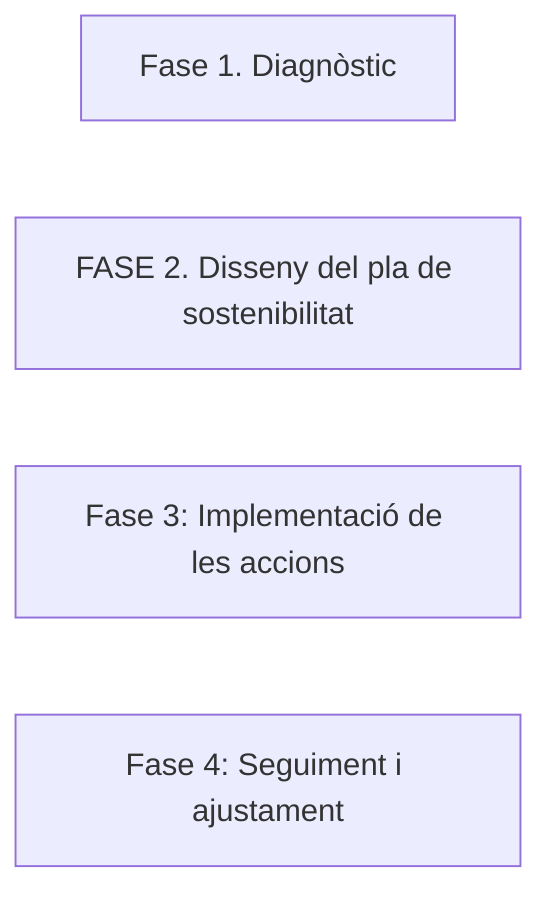

# 1. Què és un pla de sostenibilitat? Estructura i fases

En aquest apartat veurem què és un **pla de sostenibilitat empresarial**, com es dissenya, les seves **fases d'implementació** i quins elements ha de contenir per garantir que una empresa TIC siga responsable i sostenible. 

## 1.1 **Què és un pla de sostenibilitat?**

Un **pla de sostenibilitat** és un document estratègic que estableix les **metes, accions** i **indicadors** per garantir que una empresa **reduïsca el seu impacte ambiental**, siga **socialment responsable** i complisca amb les normatives de **governança sostenible**. El pla de sostenibilitat no només inclou pràctiques per reduir el consum de recursos i les emissions, sinó també mesures per **impulsar el benestar social** i garantir la **transparència i ètica empresarial**.

Els beneficis de disposar d'un pla de sostenibilitat a les empreses TIC són:

- **Reducció de costos operatius** (per exemple, mitjançant l'optimització del consum energètic).
- **Millora de la imatge corporativa** i **reputació** davant dels consumidors i inversors.
- **Compliment normatiu** amb **les lleis ambientals i socials** a nivell nacional i internacional.
- **Atraure talent i clients conscienciats amb la sostenibilitat**.

## 1.2 **Estructura d'un pla de sostenibilitat empresarial**

Un pla de sostenibilitat es divideix en diverses parts clau que permeten estructurar les **accions concretes**, establir els **objectius** i determinar les **mètriques** per mesurar els avanços. Aquesta estructura sol incloure:

### 1. **Anàlisi inicial**

Un pla de sostenibilitat comença amb una **anàlisi inicial** de l'empresa per avaluar la situació actual i identificar àrees de millora. Aquesta etapa implica la **recollida de dades** i l'**avaluació de l'impacte ambiental i social** de les operacions de l'empresa.

#### **Diagnòstic de l'empresa**

Aquesta fase consisteix en **analitzar els processos de l'empresa** per identificar les **fonts d'impacte ambientals, socials i de governança** més rellevants. Això pot incloure:

* **Ús d'energia**: Estudiar el **consum energètic** de les operacions de l'empresa, com els **centres de dades (CPDs)**, la xarxa corporativa i les oficines. Es valora si l'energia prové de fonts renovables i quina **eficiència energètica** s'aplica en la infraestructura.
* **Emissions de CO₂**: Determinar les **emissions de gasos d'efecte hivernacle** associades a les activitats de l'empresa. Això inclou la **fabricació de productes** (maquinari o software), el consum energètic, els desplaçaments de treballadors, etc.
* **Gestió de residus**: Avaluar com l'empresa gestiona els **residus** generats (com els **residus electrònics** o e-waste, materials de fabricació, etc.). És important entendre quina part d'aquests residus es recicla i com es poden reduir o reutilitzar.
* **Altres àrees crítiques**: Analitzar altres aspectes com **l'ús d'aigua**, **l'impacte social de les operacions (drets laborals, inclusió social, etc.)**, i el **procés de fabricació o subministrament** (per exemple, en què mesura els proveïdors compleixen amb les normes de sostenibilitat).

#### **Identificació dels grups d'interès**

Els **grups d'interès** (o stakeholders) inclouen totes les parts que poden **influenciar** o **veure's afectades** per les activitats de l'empresa. En un pla de sostenibilitat, és fonamental identificar qui són i quins són els seus interessos respecte a la sostenibilitat de l'empresa. Alguns exemples de grups d'interès són:

* **Empleats**: Quines són les seves expectatives pel que fa a les condicions laborals, la inclusió social i les pràctiques sostenibles?
* **Clients**: Com esperen els clients que l'empresa **redueixi el seu impacte ambiental**? Quins són els seus valors en relació amb la sostenibilitat?
* **Proveïdors**: Quina és la seva responsabilitat en la **cadena de subministrament**? Estan seguint bones pràctiques de sostenibilitat?
* **Inversors**: Quins objectius tenen els inversors en relació amb les **pràctiques ètiques** i **responsabilitat social** de l'empresa?
* **Comunitat local i societat**: Què esperen de l'empresa en termes de **impacte social** i **ambiental** a la seva localització geogràfica?

### 2. **Objectius de sostenibilitat**

Amb l'**anàlisi inicial** realitzada, es passa a definir **els objectius de sostenibilitat** que orientaran el pla. Els objectius han de ser **concrets**, **mesurables** i **realitzables**, per tal que puguin ser seguits i **avaluats al llarg del temps**.

#### **Establir metes clares i mesurables**

L'empresa ha de definir **quins canvis vol aconseguir** i **com els mesurarà**. Alguns exemples d'objectius podrien ser:

* **Reducció de les emissions de CO₂**: Fixar una meta per reduir les emissions d'**un 10% en els pròxims 5 anys**, a través de l'optimització de processos i l'adopció d'energia renovable.
* **Optimització de l'ús energètic**: Comprometre's a aconseguir que **un 50% de l'energia provingui de fonts renovables** dins de 3 anys.
* **Reciclatge i reutilització de productes i components**: Establir un objectiu per aconseguir un **40% de reciclatge** de materials, o la reutilització de **dispositius electrònics obsolets** per reduir el malbaratament.

Els objectius haurien de tenir en compte les **metodologies d'avaluació** i assegurar-se que les metes siguen **realistes**, **alineades amb els ODS**, i adequades als recursos disponibles.

### 3. **Estratègies i accions**

Un cop establerts els objectius, cal definir les **accions concretes** que es duran a terme per assolir-los. Aquestes accions s'han de basar en **bones pràctiques** i en **estratègies que impliquin tothom dins l'organització**.

#### **Accions concretes a implementar**:

* **Eficiència energètica**: Adoptar **tecnologies més eficients** per als servidors, **millorar l'eficiència energètica dels centres de dades**, i promoure l'ús de **font d'energia renovables**.
* **Disseny d'aplicacions eficients**: Desenvolupar software que siga **eficient en l'ús de recursos** (memòria, processador, etc.), així com utilitzar infraestructures **més sostenibles** per allotjar les aplicacions.
* **Millores en la gestió de residus**: Implementar programes interns de **reciclatge** i **reducció de residus electrònics**. Això inclou la **recollida de dispositius obsolets** per donar-los una segona vida.
* **Formació d'empleats**: Crear programes de formació per als **empleats** per conscienciar-los sobre les bones pràctiques en sostenibilitat, tant dins com fora de l'empresa.

#### **Sistemes de gestió ambiental**:

L'empresa pot implementar sistemes de gestió ambiental com **ISO 14001** per garantir el compliment de les normatives i les **bones pràctiques ambientals** a tots els nivells de l'empresa.

### 4. **Mesura i seguiment**

És fonamental mesurar el **rendiment sostenible** i assegurar-se que s'estan assolint els objectius proposats. Això es fa mitjançant **indicadors clau de rendiment (KPIs)** que ajuden a **monitoritzar el progrés** i permeten ajustar les accions si cal.

#### **Indicadors clau de rendiment (KPIs)**

* **Quantitat de CO₂ reduït**: Mida de les **emissions de CO₂ evitades** gràcies a les accions implementades.
* **Quantitat de materials reciclats**: Quantitat de **material reciclat o reutilitzat** respecte als materials usats durant el període.
* **Percentatge d'energia renovable utilitzada**: Mesura de l'**energia renovable** utilitzada en comparació amb l'energia total consumida per l'empresa.

#### **Informes de sostenibilitat**

Els informes de sostenibilitat són documents regulars que ajuden a **comunicar els avanços** i el **compliment dels objectius de sostenibilitat** als grups d'interès. Aquests informes poden incloure:

* Resultats dels **KPIs**.
* Accions i **estratègies futures** per continuar millorant en sostenibilitat.

### 5. **Comunicació i transparència**

Finalment, és important que l'empresa **comunique de manera clara** els avanços i resultats del seu pla de sostenibilitat als **grups d'interès** (empleats, clients, inversors, etc.).

#### **Informar als grups d'interès**

Una bona pràctica és crear informes anuals, **memoràndums** o utilitzar **plataformes digitals** per a compartir els avanços del pla de sostenibilitat.

#### **Certificació i reconeixement**

Obtenir **certificacions ambientals** com **ISO 50001** o **Energy Star** ajuda a **garantir** que l'empresa segueix les millors pràctiques i és reconeguda pels seus esforços en sostenibilitat.

## 1.3 **Fases per implementar un pla de sostenibilitat**

La implementació d'un **pla de sostenibilitat** no és una tasca que es faça de manera immediata. És un procés **estratègic i a llarg termini**, que es divideix en diverses **fases** clau. Aquestes fases permeten a l'empresa definir les **accions concretes**, **mesurar els avanços** i fer els **ajustaments necessaris** per aconseguir els objectius de sostenibilitat establerts.

Les fases per a la implementació d'aquest pla són 4:

* **Fase 1. Diagnòsetic**: La primera fase del pla de sostenibilitat és la **fase diagnòstica**, on es realitza una anàlisi exhaustiva de la situació actual de l'empresa. Aquesta fase és fonamental per entendre els punts de partida i identificar les **àrees de millora**. És en aquesta fase on es realitza l'**anàlisi inicial**, amb el **diagnòstic de l'empresa** pròpiament dit, i la **identificació dels grups d'interès**.
* **Fase 2. Disseny del pla de sostenibilitat**: Un cop feta l'anàlisi inicial, es defineixen **els objectius concrets** (segon apartat del pla) i es dissenyen **les estratègies per aconseguir-los** (tercer apartat del pla). Els objectius del pla han de ser **clars**, **mesurables** i **realistes**, alineats amb les necessitats identificades a la fase anterior.
* **Fase 3: Implementació de les accions**: Un cop dissenyat el pla, arriba la fase d'**implementació**, on les accions concretes comencen a ser posades en pràctica. Aquesta fase inclou **l'assignació de recursos**, **l'establiment de mecanismes de seguiment** i la **formació del personal** perquè estiga preparat per aplicar el pla. Perquè el pla siga efectiu, és important que els empleats siguen **part de la implementació**. La **formació** i la **conscienciació** sobre els objectius de sostenibilitat i la seua importància serà fonamental perquè tots els membres de l'organització treballen de manera alineada cap als mateixos objectius.
* **Fase 4: Seguiment i ajustament**. Una vegada les accions estan en marxa, és necessari realitzar un **seguiment continu** per verificar si les accions estan tenint l'impacte esperat. Aquesta fase inclou l'ús de **indicadors clau de rendiment (KPIs)** i **informes periòdics de sostenibilitat** (Apartat 4 del pla). És important ajustar les estratègies de manera flexible per garantir que s'assoleixin els objectius. Si una acció no dona els resultats esperats, cal fer **ajustos** i redefinir les estratègies en funció dels **resultats obtinguts**. És aci on es faran també les diferents comunicacions als diferents grups d'interès i l'obtenció de certificacions (Apartat 5 del pla.)

## 1.4 **Exemples d'empreses TIC amb plans de sostenibilitat**

Veiem alguns exemples d'accions portades a terme per diverses empreses del sector.

### 1. **Google**
   - **Centres de dades verds**: Google utilitza **energia renovable** per alimentar els seus centres de dades i té l'objectiu de ser **carboni neutre** per al 2030.
   - **Informe de sostenibilitat**: Google publica anualment informes detallats sobre les seves **iniciatives ambientals** i els **progressos** aconseguits.

### 2. **Microsoft**
   - **Compromís amb la neutralitat de carboni per al 2030**: Microsoft ha establert un objectiu de ser **carboni neutral** i **compensar totes les seves emissions històriques**.
   - **Reciclatge de productes**: Microsoft promou la **reutilització de components** i el **reciclatge d'equipament tecnològic** en el seu model de negoci.

### 3. **HP**
   - **Productes amb materials reciclats**: HP fa servir **plàstic reciclat** de l'oceà per fabricar els seus ordinadors portàtils.
   - **Certificacions d'eficiència energètica**: Els productes HP compleixen amb les **certificacions Energy Star** i altres estàndards de **sostenibilitat ambiental**.

!!!question "Activitats"
     1. Investiga quins són els **principals KPIs** que utilitzen les empreses TIC per mesurar la **sostenibilitat** i explica com es poden utilitzar per monitoritzar els objectius.
     2. Investiga quins són els **principals components d'un pla de sostenibilitat** en una empresa TIC i explora com les **normatives ambientals** es poden integrar en el pla.
     3. Quins elements creus que serien **més difícils d'implementar** en un pla de sostenibilitat a una empresa TIC? Per què?
     4. Com afecten els **grups d'interès** als plans de sostenibilitat? Quins són els **principals grups d'interès** per una empresa TIC i què esperen d'un pla de sostenibilitat?
     5. Analitza el **pla de sostenibilitat d'una empresa TIC** coneguda (com Google o Microsoft) i explica quines accions concretes estan implementant.
     6. En grups, dissenyeu un **pla de sostenibilitat per a una empresa TIC fictícia**, incloent les fases, objectius, accions concretes i KPIs per mesurar l'èxit.
     7. Dissenyeu un **informe de sostenibilitat** per presentar als grups d'interès, tenint en compte el seguiment dels KPIs establerts i la comunicació de l'impacte.

!!!info "Recursos"
     * **Google Sustainability**: [https://sustainability.google/](https://sustainability.google/)
     * **Microsoft Sustainability**: [https://www.microsoft.com/sustainability](https://www.microsoft.com/sustainability)
     * **ISO 14001 - Sistema de gestió ambiental**: [https://www.iso.org/iso-14001-environmental-management.html](https://www.iso.org/iso-14001-environmental-management.html)
     * **GHG Protocol**: [https://ghgprotocol.org/](https://ghgprotocol.org/)